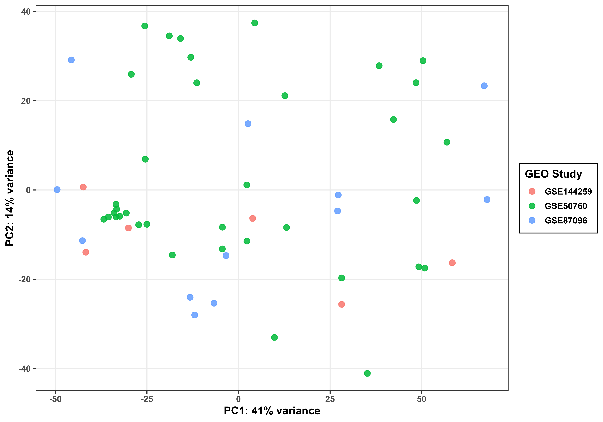
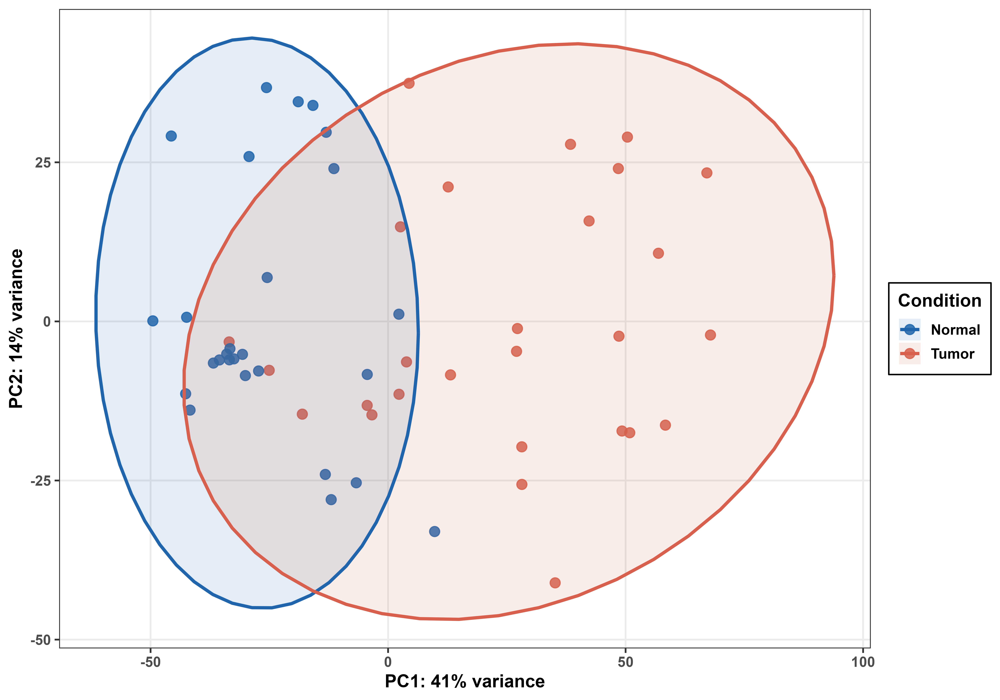
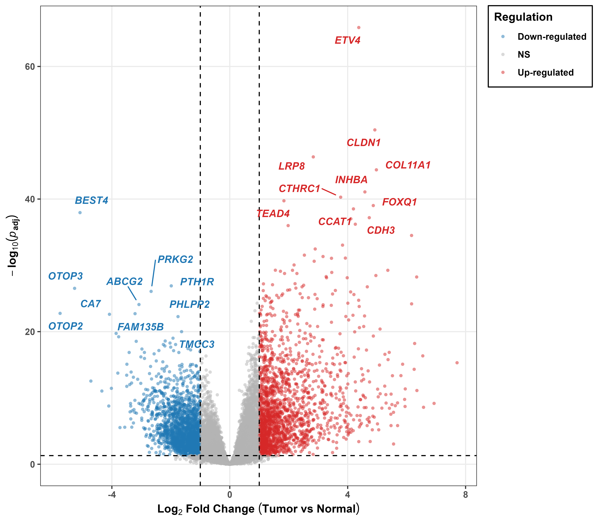
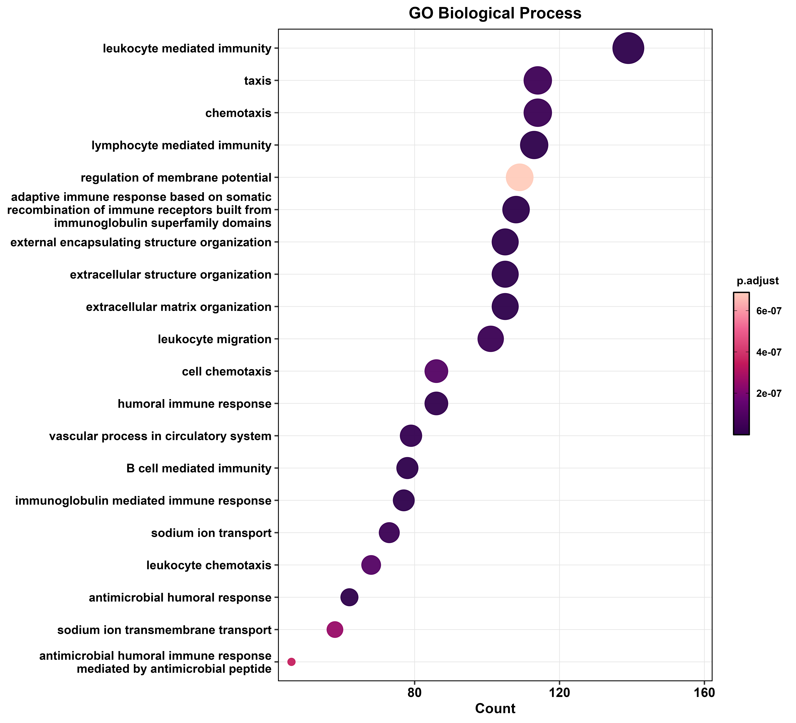
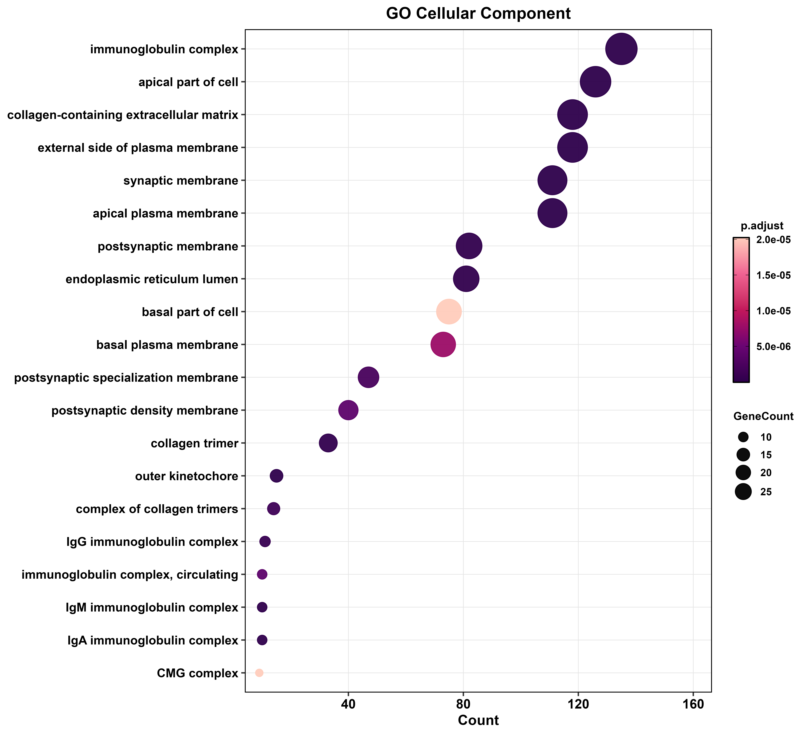
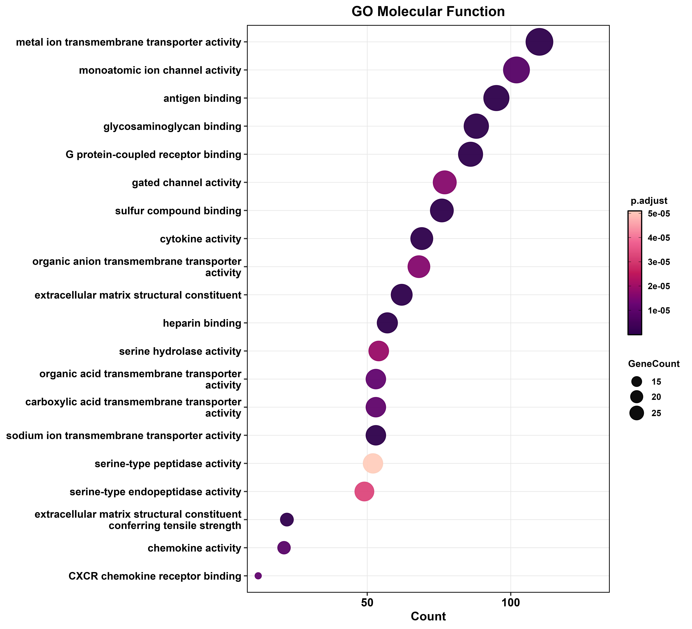
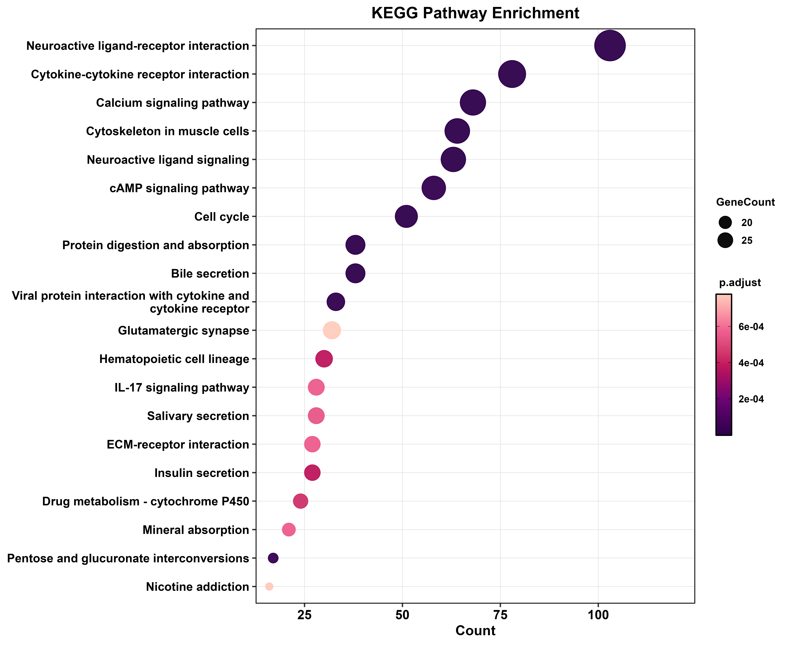

# A Unified Computational Framework for Bulk RNA-seq Analysis in Colorectal Cancer

[-8A2BE2.svg)](https://bioconductor.org/packages/sva/)

## Project Overview
This repository contains a comprehensive and highly rigorous computational pipeline designed for the transcriptomic evaluation of Colorectal Cancer (CRC). Colorectal cancer represents a highly prevalent gastrointestinal malignancy characterized by complex underlying molecular mechanisms and profound tumor heterogeneity. 

A major challenge in transcriptomic meta-analyses is the limited statistical power of individual studies and the technical batch effects that arise when combining datasets across different sequencing platforms or institutions. By systematically integrating independent bulk RNA-seq datasets sourced from the NCBI Gene Expression Omnibus (GEO), this project aims to identify robust, highly confident transcriptomic signatures and co-expression modules associated with CRC tumorigenesis. 

The core of this project relies on a unified R script written to process raw count matrices, apply negative binomial regression to eliminate cross-study technical batch effects, perform differential expression analysis, and execute systems-level weighted gene co-expression network analysis (WGCNA).

## Datasets Analyzed
To ensure maximum biological consistency and statistical power, this study utilizes a strictly curated meta-cohort comprising **54 individual samples** (27 normal adjacent/control tissues and 27 primary CRC tumors). 

* **GSE144259:** 6 samples (3 Normal, 3 Tumor). 
  * *Exclusion Criteria:* 3 metastatic samples (CRC1M, CRC2M, CRC3M) were explicitly excluded to focus solely on primary tumor biology.
* **GSE50760:** 36 samples (18 Normal, 18 Tumor). 
  * *Exclusion Criteria:* 18 metastatic samples designated by the suffix '-3' were systematically excluded prior to count matrix integration.
* **GSE87096:** 12 samples (6 Normal, 6 Tumor). 
  * *Exclusion Criteria:* Filtered to retain only standard RNA-seq samples; 24 MeDIP/hMeDIP DNA methylation profiling samples were excluded to maintain uniform data modalities.

## Analytical Methodology & Core Pipeline

The entire end-to-end computational workflow is executed via a single, highly modular R script located at **`r script/colaon_bulk_rna.R`**. 

### 1. Preprocessing & Technical Batch Correction (ComBat-seq)
Raw counts from the three independent GEO cohorts were filtered for common genes and merged into a single combined count matrix. Cross-study technical variance was mitigated directly at the raw count level using `ComBat_seq`. Unlike standard ComBat, which operates on normalized data, ComBat-seq utilizes a negative binomial regression model to adjust batch effects while preserving the integer nature of the RNA-seq counts, maintaining the strict statistical assumptions required for downstream modeling.

### 2. Differential Expression Modeling (DESeq2)
Differential Gene Expression (DGE) modeling was performed on the combined count matrix using `DESeq2`, contrasting the primary Tumor condition against the Normal control. Biotype filtering via custom regex matching was applied to remove non-coding elements (LOC, MIR, snoRNAs, LINC), isolating functionally relevant protein-coding targets.

### 3. Weighted Gene Co-Expression Network Analysis (WGCNA)
To move beyond single-gene DGE, systems-level transcriptomic architecture was modeled using `WGCNA`. Variance-stabilized (VST) counts, filtered for the top 5000 highly variable genes, were used to construct a scale-free topological network (soft threshold power = 14). Genes were clustered into co-expression modules, which were subsequently correlated with the clinical trait (Diseased vs. Control) to identify primary driver modules in CRC pathogenesis.

### 4. Functional Enrichment & ID Translation
Significant protein-coding transcripts and hub genes were subjected to over-representation analysis (ORA) across Gene Ontology (BP, CC, MF) and KEGG Pathways using `clusterProfiler`. A dedicated annotation module utilizing `biomaRt` was implemented to accurately map complex STRING database ENSP IDs back to universal Gene Symbols and Entrez IDs for network continuity.

---

## Visualizations

### Quality Control: Principal Component Analysis (PCA)
The PCA visualizations validate the efficacy of the ComBat-seq batch correction. The 54 samples successfully cluster according to biological condition (PC1) rather than their respective GEO source study.

  
  

### Differential Expression Landscape
Global shifts in CRC gene expression are mapped via a Volcano plot, accompanied by a hierarchical clustering Heatmap highlighting the consistent, normalized expression patterns of the top 50 highly significant differentially expressed genes across the meta-cohort.

  
  

### Functional Enrichment (GO & KEGG)
Elucidation of functional roles across Gene Ontology categories and KEGG pathways driving the transcriptomic signature, compiled into a single high-density collage.

<table align="center" style="width:100%; border:none;">
  <tr>
    <td width="50%"></td>
    <td width="50%"></td>
  </tr>
  <tr>
    <td width="50%"></td>
    <td width="50%"></td>
  </tr>
</table>

### Systems Biology: WGCNA
Scale-free topology determination, hierarchical clustering, and module-trait relationship heatmaps identifying highly correlated gene clusters within the CRC meta-cohort.

  

  

---

## Repository Structure
* **`r script/colaon_bulk_rna.R`** : Core R script executing the full analytical workflow from raw data ingestion to visualization.
* `count_matrix_metadata/` : Uncompressed `.tsv.gz` raw data files and merged clinical metadata.
* `results_CRC/01_objects/` : Serialized R objects (`.rds`) for rapid local reloading of DESeq2 and WGCNA environments.
* `results_CRC/02_tables/` : Compiled DEG outputs, module assignments, raw/adjusted count matrices, and ORA results.
* `results_CRC/03_plots/` : High-fidelity graphical outputs. *Note: Heavy, uncompressed `.tiff` files generated for publication are excluded from version control via `.gitignore`.*

---
